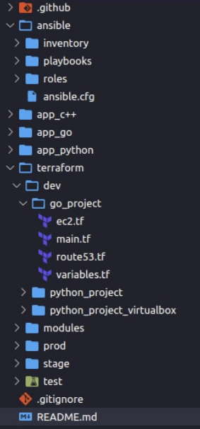

# 5 

## Ansible 1

In this lab you need to get familiar with a CD tool - Ansible. Then use it to deploy docker on newly created cloud VM. You will need it for your application deployment in the next lab.

0. Create a workspace for a development environment on cloud (recommended is AWS)
* Prepare .tf files.
* Use terraform fmt, terraform validate.
* Create a VM.
* Provide screenshots from local console in TF.md. Also you can provide screenshots from cloud.

1. Tidy you repository, try to follow the suggested structure, separate folders for app, terraform,
ansible:

2. Install ansible and read about it.

> Ansible intro -
https://docs.ansible.com/ansible/latest/installation_guide/intro_installation.html Tricks and
Tips - https://docs.ansible.com/ansible/latest/user_guide/playbooks_best_practices.html

3. Create an ansible role for docker. There are two ways:
* Write a role from scratch
* Or use one from `ansible-galaxy` as a template.

> https://github.com/geerlingguy/ansible-role-docker Don't use shell or command modules!

4. Create a playbook.

5. Deploy the role.
* Show screenshots of playbook run in ANSIBLE.md

6. Destroy the environment using terraform destroy.

### List of requirements
* Your repository follows suggested structure
* You have .tf files for any cloud provider
* Screenshots of VM created in TF.md
* Docker role is present in `ansible/roles`
* Playbook is present for deploying docker role
* Screenshots of playbook run are present

## Bonus

1. Set up dynamic inventory for your cloud

> AWS example
https://docs.ansible.com/ansible/latest/collections/amazon/aws/aws_ec2_inventory.html